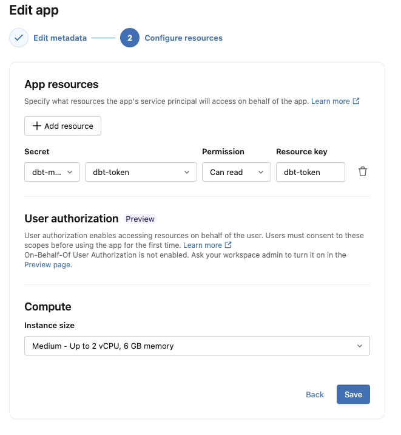
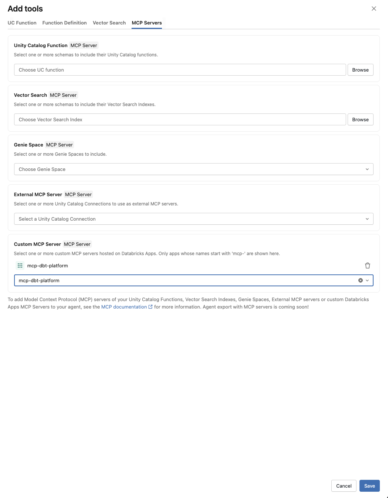
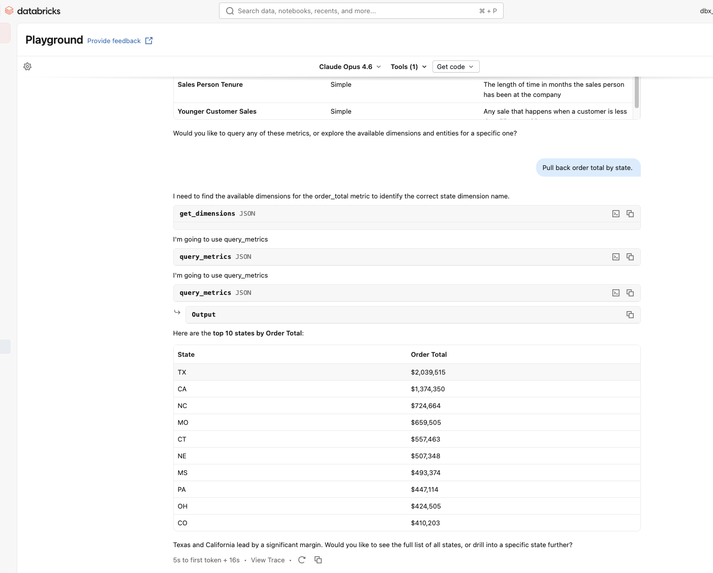

# How to Set Up Databricks dbt MCP

## Summary

Deploying dbt-mcp as a custom MCP server on Databricks requires two things:

1. **A script entry point in `pyproject.toml`** — this already existed (`dbt-mcp = "dbt_mcp.main:main"`), so no changes were needed.
2. **An `app.yaml` file** — this was created to tell Databricks how to run the server. It invokes `uv run dbt-mcp` and sets environment variables for transport and build configuration. Sensitive dbt Cloud credentials are securely referenced via a `resources` block with `valueFrom` (not the `{{secrets/...}}` syntax, which does not work for Databricks Apps).

Databricks apps expect the server to listen on port 8000. FastMCP defaults to port 8000 for HTTP transports, so no port override was necessary.

---

## Detailed Walkthrough

### Prerequisites

- A Databricks workspace with Apps enabled
- `uv` installed for Python dependency management
- dbt Platform credentials (API keys, environment IDs, etc.) ready to configure

### Step 1: Clone the dbt-mcp Repository

Clone the dbt-mcp repository from GitHub:

```bash
git clone https://github.com/dbt-labs/dbt-mcp.git
cd dbt-mcp
```

This gives you the full source code, including the `pyproject.toml` with the script entry point and all the tool definitions. All subsequent steps assume you're working from inside this directory.

### Step 2: Script Entry Point in `pyproject.toml`

The file `pyproject.toml` already contained the following section:

```toml
[project.scripts]
dbt-mcp = "dbt_mcp.main:main"
```

This tells `uv` that when you run `uv run dbt-mcp`, it should:

1. Look up the `dbt-mcp` script definition
2. Resolve the module path `dbt_mcp.main` (which maps to `src/dbt_mcp/main.py`)
3. Call the `main()` function in that module

The `main()` function in `src/dbt_mcp/main.py` does the following:

- Loads the dbt configuration via `load_config()`
- Creates the MCP server via `create_dbt_mcp(config)`
- Reads the `MCP_TRANSPORT` environment variable (defaulting to `stdio`)
- Starts the server with the specified transport

**No changes were made to `pyproject.toml`.**

### Step 3: Creating `app.yaml`

A new file `app.yaml` was created at the repository root with the following contents:

```yaml
command:
  [
    "uv",
    "run",
    "dbt-mcp",
  ]
env:
  - name: MCP_TRANSPORT
    value: "streamable-http"
  - name: SETUPTOOLS_SCM_PRETEND_VERSION
    value: "0.0.0"
  - name: DBT_HOST
    value: "<your-dbt-host>"
  - name: DBT_HOST_PREFIX
    value: "<your-account-prefix>"
  - name: DBT_TOKEN
    valueFrom: dbt-token
  - name: DBT_PROD_ENV_ID
    value: "<your-production-environment-id>"
```

> **Important:** The `valueFrom` field references a **resource** that must be configured through the Databricks Apps UI — not in `app.yaml`. Do **not** use `{{secrets/...}}` syntax or a `resources` block in `app.yaml` — neither works. See Step 5a below for how to add the resource in the UI.

#### Why each part is needed

**`command`**: This is the CLI command Databricks will execute to start the app. `uv run dbt-mcp` looks up the script entry point defined in `pyproject.toml` and calls `dbt_mcp.main:main`.

**`env` — `MCP_TRANSPORT=streamable-http`**: By default, dbt-mcp starts in `stdio` mode (for local use with desktop AI assistants). Databricks needs the server to accept HTTP connections, so this environment variable switches the transport to `streamable-http`. The valid transport options are:

- `stdio` — standard input/output (default, for local clients)
- `sse` — server-sent events
- `streamable-http` — HTTP-based streaming (required for Databricks)

**`env` — `SETUPTOOLS_SCM_PRETEND_VERSION=0.0.0`**: The project uses `hatch-vcs` to derive its version from git tags. However, when Databricks syncs the source code, the `.git` directory is not included. Without it, `setuptools-scm` fails with the error:

> setuptools-scm was unable to detect version for /app/python/source_code.
> Make sure you're either building from a fully intact git repository or PyPI tarballs.

Setting `SETUPTOOLS_SCM_PRETEND_VERSION` provides a fallback version string so the package can build without git metadata. The value `0.0.0` is a placeholder — you can set it to any valid version string.

**`env` — dbt Cloud credentials (`DBT_HOST`, `DBT_HOST_PREFIX`, `DBT_TOKEN`, `DBT_PROD_ENV_ID`)**: These are the credentials the dbt-mcp server needs to connect to dbt Cloud. `DBT_HOST` is the base dbt Cloud host **without** the account prefix (e.g. `us1.dbt.com` or `cloud.getdbt.com`). `DBT_HOST_PREFIX` is your account prefix (e.g. `gb971`). Together they construct endpoints like `semantic-layer.gb971.us1.dbt.com`. If your dbt Cloud URL looks like `gb971.us1.dbt.com`, then `DBT_HOST` is `us1.dbt.com` and `DBT_HOST_PREFIX` is `gb971`. `DBT_TOKEN` uses `valueFrom` to reference a named resource — Databricks resolves the actual secret value at runtime so the token is never stored in plain text. The resource must be configured through the Databricks Apps UI (see Step 6).

**Port**: Databricks apps expect the server to listen on port 8000. FastMCP's default port for HTTP transports is 8000, so no port override was needed. If this ever changes, you can add a port environment variable to the `env` section.

### Step 4: Update Databricks CLI

Make sure your Databricks CLI is up to date. Version `0.224.1` and earlier do not support the Apps API — you'll get a `Could not handle RPC class` error. Update via:

```bash
brew upgrade databricks
```

### Step 5: Create Databricks Secrets

Before deploying, you need to create the Databricks secret scope and store the dbt Cloud service token. You only need to do this once.

**Option A: Via the Databricks CLI**

Since you're already working in the terminal, this is the quickest approach:

```bash
# Create the secret scope
databricks secrets create-scope dbt-mcp

# Required — dbt Cloud service token
# Get this from dbt Cloud: Account Settings > Service Tokens
databricks secrets put-secret dbt-mcp dbt-token --string-value "<your-dbt-service-token>"
```

**Option B: Via a Databricks notebook**

```python
from databricks.sdk import WorkspaceClient

w = WorkspaceClient()

# Create a secret scope for dbt MCP credentials
SCOPE = "dbt-mcp"
w.secrets.create_scope(scope=SCOPE)

# Required — dbt Cloud service token
# Get this from dbt Cloud: Account Settings > Service Tokens
w.secrets.put_secret(scope=SCOPE, key="dbt-token", string_value="<your-dbt-service-token>")

print("Secret created successfully.")
```

### Step 6: Create the App and Add the Secret Resource

First, create the Databricks app. The name is whatever you choose — it's not defined anywhere in the codebase, it only lives in Databricks. All subsequent commands that reference the app use this name. **The name must start with `mcp-`** — only apps with this prefix appear as selectable custom MCP servers in the Databricks AI Playground.

```bash
databricks apps create mcp-dbt-platform
```

Then add the dbt token as a secret resource in the UI. The `valueFrom: dbt-token` in `app.yaml` references a **resource** that must be configured through the Databricks Apps UI. Defining a `resources` block in `app.yaml` does not work — resources must be added via the UI.

1. Go to **Compute > Apps > mcp-dbt-platform**
2. Click **Edit** (top right)
3. In the **App resources** section, click **+ Add resource**
4. Select **Secret** as the resource type
5. Set the **secret scope** to `dbt-mcp` and **secret key** to `dbt-token`
6. Set the **resource key** to `dbt-token` (this must match the `valueFrom` value in `app.yaml`)
7. Click **Save**

Your configured resource should look like this:



This tells Databricks to resolve the secret at runtime and inject it as the `DBT_TOKEN` environment variable. The token is never stored in plain text in your repository.

### Step 7: Deploy

Now sync the source code and deploy:

```bash
DATABRICKS_USERNAME=$(databricks current-user me | jq -r .userName)
databricks sync . "/Users/$DATABRICKS_USERNAME/mcp-dbt-platform"

databricks apps deploy mcp-dbt-platform \
  --source-code-path "/Workspace/Users/$DATABRICKS_USERNAME/mcp-dbt-platform"
```

You can check deployment logs with:

```bash
databricks apps logs mcp-dbt-platform --tail-lines 100
```

### Reference

- [Databricks Custom MCP Server Documentation](https://docs.databricks.com/aws/en/generative-ai/mcp/custom-mcp)
- dbt-mcp entry point: `src/dbt_mcp/main.py` — the `main()` function
- dbt-mcp server: `src/dbt_mcp/mcp/server.py` — the `DbtMCP` class and `create_dbt_mcp()` factory
- Transport validation: `src/dbt_mcp/config/transport.py` — validates the `MCP_TRANSPORT` value

---

## Testing Out the MCP Connection in a Databricks Notebook

Once the app is deployed with secrets configured and credentials wired up (Steps 3–7 above), you can connect to it from a Databricks notebook. Databricks Apps require **OAuth authentication** — a simple PAT or default notebook auth won't work. You need a **service principal** with an OAuth client ID and secret.

### Step 8: Set Up a Service Principal for OAuth

Databricks-hosted MCP apps require OAuth (M2M) authentication. When you created the app, Databricks automatically created a service principal for it. However, to connect **to** the app from a notebook, you need a service principal with an OAuth secret that your notebook code can use.

#### Create a service principal

1. Go to your Databricks **Account Console** (not the workspace — click your profile icon and select "Manage account", or navigate to `accounts.cloud.databricks.com`)
2. Go to **User management > Service principals**
3. Click **Add service principal**
4. Select **Databricks managed**
5. Enter a name (e.g. `dbt-mcp-client`) and click **Add service principal**

#### Generate an OAuth secret

1. After creating the service principal, click into it
2. Go to the **Credentials & secrets** tab
3. Under **OAuth secrets**, click **Generate secret**
4. Copy both the **Client ID** and **Secret** immediately — **the secret is only shown once**

#### Assign the service principal to your workspace

The service principal was created at the **account** level, but it also needs to be assigned to the specific workspace where your app is running. Without this, the service principal can't authenticate to the workspace.

1. In the **Account Console**, go to **Workspaces**
2. Click into the workspace where your app is deployed (e.g. `dbc-c7c89cba-cf9b`)
3. Under **Permissions**, add the `dbt-mcp-client` service principal

#### Grant the service principal access to the app

Once the service principal is assigned to the workspace, grant it permission to use the app.

1. Go back to your workspace: **Compute > Apps > mcp-dbt-platform**
2. Click **Permissions** (top right)
3. Add the service principal you just created and grant it **Can Use** access

#### Store the OAuth secret in Databricks Secrets

Add the OAuth credentials to your existing secret scope so they aren't hardcoded in notebook cells.

**Option A: Via the Databricks CLI**

```bash
databricks secrets put-secret dbt-mcp oauth-client-id --string-value "<your-service-principal-client-id>"
databricks secrets put-secret dbt-mcp oauth-client-secret --string-value "<your-oauth-secret>"
```

**Option B: Via a Databricks notebook**

```python
from databricks.sdk import WorkspaceClient

w = WorkspaceClient()

SCOPE = "dbt-mcp"
w.secrets.put_secret(scope=SCOPE, key="oauth-client-id", string_value="<your-service-principal-client-id>")
w.secrets.put_secret(scope=SCOPE, key="oauth-client-secret", string_value="<your-oauth-secret>")

print("OAuth secrets stored.")
```

### Environment Variable Reference

The dbt-mcp server reads its configuration from environment variables. The three required variables (`DBT_HOST`, `DBT_TOKEN`, `DBT_PROD_ENV_ID`) are already configured in `app.yaml` from Step 3. These additional variables are optional and only needed for specific toolsets:

| Environment Variable | Description | Needed For |
|---|---|---|
| `DBT_DEV_ENV_ID` | Development environment ID | SQL tools (`execute_sql`) |
| `DBT_USER_ID` | Your dbt Cloud user ID | SQL tools (`execute_sql`) |

To add these, create the corresponding secrets in Databricks and add new `env` entries to `app.yaml` using the `{{secrets/dbt-mcp/...}}` syntax, then redeploy.

### Install Dependencies

In the first cell of your notebook, install the required packages:

```python
%pip install databricks-mcp typing_extensions nest_asyncio --upgrade
dbutils.library.restartPython()
```

### Connecting to the MCP Server

Use the service principal OAuth credentials to authenticate to the deployed app. Databricks notebooks run inside an existing async event loop, so `nest_asyncio` is required to allow the MCP client's async calls to work:

```python
import nest_asyncio
nest_asyncio.apply()

from databricks_mcp import DatabricksMCPClient
from databricks.sdk import WorkspaceClient

mcp_server_url = "https://<your-app-url>/mcp"

# Authenticate with OAuth service principal credentials
workspace_client = WorkspaceClient(
    host="https://<your-workspace-url>",
    client_id=dbutils.secrets.get(scope="dbt-mcp", key="oauth-client-id"),
    client_secret=dbutils.secrets.get(scope="dbt-mcp", key="oauth-client-secret")
)

mcp_client = DatabricksMCPClient(server_url=mcp_server_url, workspace_client=workspace_client)

# List available tools
tools = mcp_client.list_tools()
print(f"Found {len(tools)} tools:")
for tool in tools:
    print(f"  - {tool.name}")
```

> **Note:** `WorkspaceClient()` with no arguments uses default notebook auth (PAT-based), which Databricks Apps reject. You must explicitly pass `client_id` and `client_secret` for OAuth M2M authentication. The `host` should be your **workspace URL** (e.g. `https://adb-xxxxx.x.azuredatabricks.net`), not the app URL.

### Calling a Tool

```python
# Example: list metrics from the semantic layer
result = mcp_client.call_tool("list_metrics", {})
print(result)
```

```python
# Example: get details about a specific model
result = mcp_client.call_tool("get_model_details", {"unique_id": "model.my_project.my_model"})
print(result)
```

---

## Ways to Use the dbt Platform MCP in Databricks

The notebook approach above is useful for **testing the connection**, but the real value of the MCP server is giving AI tools access to your dbt project. Here's where you can use it:

- **AI Playground** — The quickest way to interact with the MCP. Go to **AI/ML > Playground**, select a model, click **Add tools > MCP Servers > Custom MCP Server**, and select your `mcp-dbt-platform` app. Ask natural language questions like "What are my top metrics by state?" and the LLM will call dbt tools to get the answer.



- **AI Agents (Mosaic AI Agent Framework)** — Build an agent that connects to the MCP server as a tool source. The agent can reason about your dbt project — querying metrics, exploring lineage, checking model health — and be deployed as a serving endpoint for production use.

- **Genie Spaces** — Genie already has SQL/data integration, but adding the dbt MCP gives it access to semantic layer metrics, model metadata, and lineage context.

- **External AI Applications** — Any MCP-compatible client (Claude Desktop, Cursor, custom apps) can connect to the Databricks-hosted endpoint using the streamable-http transport and the app URL.


